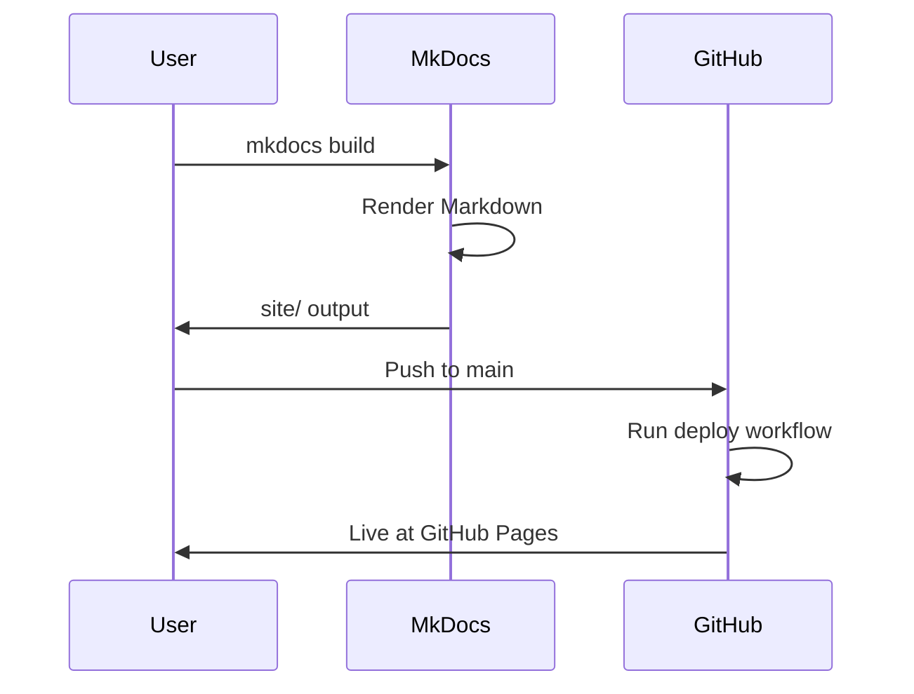
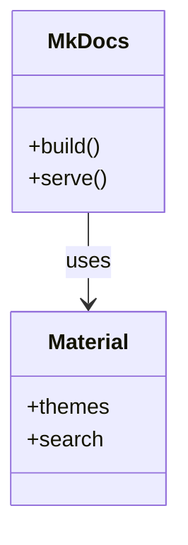
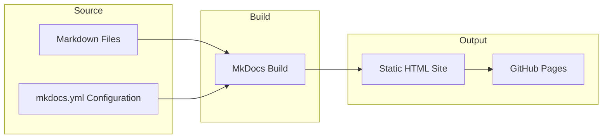

# Code Examples

This page demonstrates code blocks with **syntax highlighting**, **line numbers**, and **copy-to-clipboard** functionality in Java, YAML, and Bash. It also includes **code tabs** and **Mermaid diagrams**.

## Java Example

The following Java snippet shows a simple service class:

``` java
package com.example.service;

import java.util.Optional;

/**
 * Example service class for the MkDocs POC.
 */
public class HelloService {

    public Optional<String> greet(String name) {
        if (name == null || name.isBlank()) {
            return Optional.empty();
        }
        return Optional.of("Hello, " + name + "!");
    }

    public static void main(String[] args) {
        var service = new HelloService();
        service.greet("MkDocs").ifPresent(System.out::println);
    }
}
```

## YAML Example

Configuration for a CI pipeline:

``` yaml
name: Deploy Documentation

on:
  push:
    branches: [main]

jobs:
  build:
    runs-on: ubuntu-latest
    steps:
      - uses: actions/checkout@v4
      - uses: actions/setup-python@v5
        with:
          python-version: '3.11'
      - run: pip install -r requirements.txt
      - run: mkdocs build
```

## Bash Example

Build and serve locally:

``` bash
#!/bin/bash
set -e

# Install dependencies
pip install -r requirements.txt

# Build documentation
mkdocs build

# Optional: serve locally
mkdocs serve
```

## Language tabs

Use tabs to present equivalent snippets in multiple languages while saving vertical space. MkDocs supports this via the **pymdownx.tabbed** extension (already enabled in `mkdocs.yml`).

Same workflow in different formats:

=== "Bash"

    ``` bash
    npm install
    npm run start

    # Build the static site
    npm run build
    ```

=== "YAML"

    ``` yaml
    scripts:
      start: docusaurus start
      build: docusaurus build
    ```

=== "JSON"

    ``` json
    {
      "scripts": {
        "start": "docusaurus start",
        "build": "docusaurus build"
      }
    }
    ```

## Code tabs (shells)

Compare the same command across shells:

=== "Bash"

    ``` bash
    source venv/bin/activate
    mkdocs serve
    ```

=== "PowerShell"

    ``` powershell
    .\venv\Scripts\Activate.ps1
    mkdocs serve
    ```

=== "Command Prompt"

    ``` cmd
    venv\Scripts\activate.bat
    mkdocs serve
    ```

## Mermaid Diagrams

### Sequence Diagram



### Class Diagram



### Flowchart

Doc build pipeline:



## Tables and Admonitions

### Feature Support

| Feature | Supported |
|---------|-----------|
| Markdown | Yes |
| Search | Yes |
| PDF Export | Yes |
| Dead link detection | Yes (via mkdocs-linkcheck) |

!!! tip "Pro Tip"
    Use `mkdocs serve` during development. Changes to Markdown files trigger an automatic reload.

!!! warning "PDF Generation"
    PDF export requires WeasyPrint and system dependencies (cairo, Pango). See the project README in the repository for installation details.

!!! note "Internal Links"
    Link to [Getting Started](getting-started.md) or a specific section: [Installation](getting-started.md#installation).
